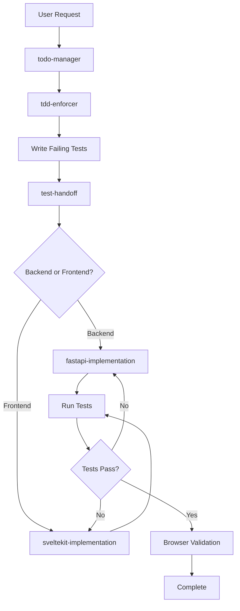

# Attack-a-Crack v2 Agent System

## 🎯 Overview

This directory contains specialized AI agents that enforce Test-Driven Development (TDD) and enable seamless handoffs between different phases of development. The system is designed to prevent the issues experienced in v1, particularly false "it's working" claims and lack of test coverage.

## 🔄 The Agent Workflow



## 🤖 Core Agents

### 1. **todo-manager** 📝
**Purpose**: Persistent task tracking that survives session crashes
**Key Features**:
- Saves to `.claude/todos/current.md` after EVERY change
- Maintains recovery context with file paths and line numbers
- Archives completed sessions
- Enables seamless handoff between sessions

**When to Use**: ALWAYS at the start of any multi-step task

### 2. **tdd-enforcer** 🧪
**Purpose**: Enforces test-first development without exceptions
**Key Features**:
- Writes comprehensive tests before any implementation
- Ensures tests fail initially (RED phase)
- Blocks any attempt to write code without tests
- Enforces 95% coverage minimum

**When to Use**: Before implementing ANY new feature

### 3. **test-handoff** 🤝
**Purpose**: Orchestrates handoff from test-writing to implementation
**Key Features**:
- Creates detailed handoff documents
- Verifies tests are complete and failing
- Specifies exact implementation requirements
- Enables inter-agent communication

**When to Use**: After tests are written, before implementation

### 4. **fastapi-implementation** ⚡
**Purpose**: Implements FastAPI backend features to pass tests
**Key Features**:
- Writes minimal code to pass existing tests
- Follows FastAPI best practices
- Full async/await implementation
- No feature creep beyond test requirements

**When to Use**: After receiving handoff for backend work

### 5. **sveltekit-implementation** 🎨
**Purpose**: Implements SvelteKit frontend features to pass tests
**Key Features**:
- Component development with tests
- API integration
- Form validation
- Responsive design

**When to Use**: After receiving handoff for frontend work

## 📋 Testing Specialist Agents

### **unit-test-specialist** 🔬
- Fast, isolated unit tests with pytest
- Mock and patch strategies
- 95%+ coverage optimization
- Test parametrization

### **integration-test-specialist** 🧪
- API endpoint testing
- Service layer integration tests
- Database transaction testing
- Mock external services

### **playwright-test-specialist** 🎭
- Browser E2E test writing
- Page Object Model implementation
- Cross-browser testing
- Screenshot evidence collection

## 📋 Domain Specialist Agents

### **campaign-specialist** 📧
- Campaign logic implementation
- A/B testing
- Business hours enforcement
- Daily limit management

### **openphone-specialist** 📱
- OpenPhone API integration
- Webhook processing
- SMS sending/receiving
- Rate limiting

### **database-specialist** 🗄️
- PostgreSQL optimization
- Alembic migrations
- Query performance
- Transaction management

## 📋 Infrastructure Agents

### **cicd-specialist** 🔄
- GitHub Actions workflows
- Docker containerization
- DigitalOcean deployment
- Security scanning integration

## 🔄 The TDD Workflow

### Step 1: Task Initialization
```bash
# User: "Add daily limit to campaigns"
# Claude: Uses todo-manager to track task
```

### Step 2: Test Writing
```bash
# tdd-enforcer writes comprehensive tests
# Tests must fail initially
# Creates: tests/test_campaign_limits.py
```

### Step 3: Handoff Creation
```bash
# test-handoff creates detailed document
# Specifies what needs implementation
# Creates: .claude/handoffs/active/campaign-limits.md
```

### Step 4: Implementation
```bash
# fastapi-implementation reads handoff
# Implements ONLY what tests require
# Runs tests continuously
```

### Step 5: Validation
```bash
# All tests must pass
# Coverage must be >95%
# Browser screenshot required
```

## 📁 File Structure

```
.claude/
├── agents/                  # Agent definitions
│   ├── README.md            # This file
│   ├── todo-manager.md      # Persistent task tracking
│   ├── tdd-enforcer.md      # Test-first enforcement
│   ├── test-handoff.md      # Inter-agent handoff
│   └── fastapi-implementation.md
├── todos/                   # Task persistence
│   ├── current.md          # Active session todos
│   └── archive/            # Historical sessions
├── handoffs/               # Agent communication
│   ├── active/            # Current handoffs
│   └── completed/         # Successful handoffs
├── CLAUDE.md              # Main rules and architecture
└── mcp-servers.json       # MCP configuration
```

## 🚀 How to Use the System

### For New Features
1. Start with todo-manager to track the task
2. Use tdd-enforcer to write comprehensive tests
3. Use test-handoff to create implementation spec
4. Use appropriate implementation agent
5. Validate with browser testing

### For Bug Fixes
1. Use tdd-enforcer to write failing test for bug
2. Use implementation agent to fix
3. Ensure all existing tests still pass

### For Refactoring
1. Ensure tests exist and pass
2. Make changes
3. Verify tests still pass
4. No new features without new tests

## ⚠️ Critical Rules

### NEVER:
- Write code before tests
- Claim "it works" without browser proof
- Modify tests to match buggy implementation
- Add features not required by tests
- Skip the agent workflow

### ALWAYS:
- Use todo-manager for tracking
- Write tests first with tdd-enforcer
- Create handoffs with test-handoff
- Implement only what tests require
- Validate with browser screenshots

## 📊 Success Metrics

The agent system is working when:
- 100% of features have tests written first
- 95%+ code coverage on new code
- Zero "it works" false positives
- Seamless handoffs between agents
- Complete context preservation between sessions

## 🔧 Configuration

### MCP Servers Required
- **playwright**: Browser testing
- **postgresql**: Database operations
- **github**: Repository management
- **filesystem**: File operations
- **docker**: Container management
- **ref**: Documentation access

See `mcp-servers.json` for configuration details.

## 📝 Agent Communication Protocol

### Handoff Document Format
```markdown
# Test Handoff: [Feature]
From: tdd-enforcer
To: fastapi-implementation
Tests: 15 failing, 0 passing
Handoff Doc: .claude/handoffs/active/[timestamp].md
```

### Completion Message Format
```markdown
# Implementation Complete: [Feature]
From: fastapi-implementation
Tests: 0 failing, 15 passing ✅
Coverage: 97.5%
Screenshot: .claude/screenshots/[feature].png
```

## 🎯 The Goal

This agent system ensures:
1. **Reliability**: Tests catch bugs before production
2. **Efficiency**: Clear handoffs prevent confusion
3. **Quality**: High coverage prevents regressions
4. **Honesty**: Browser validation prevents false claims
5. **Persistence**: Todo tracking survives all failures

## 🔄 Continuous Improvement

The agent system is designed to evolve. New agents can be added for:
- Performance testing
- Security scanning
- Documentation generation
- Deployment automation

But the core TDD workflow remains constant: **Test → Implement → Validate**

---

Remember: The agents are here to enforce discipline and prevent the mistakes of v1. Trust the process, and the code quality will follow.