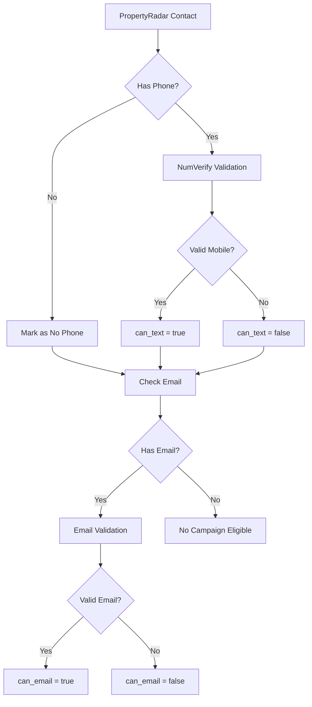

# PropertyRadar Data Model

## CSV Fields Analysis (from test-large.csv)

### Property Information (Core)
| Field | CSV Column | Type | Description | Priority |
|-------|------------|------|-------------|----------|
| Type | Type | String | Property type | Medium |
| Address | Address | String | Street address | **Critical** |
| City | City | String | City name | **Critical** |
| ZIP | ZIP | String | ZIP code | **Critical** |
| Subdivision | Subdivision | String | Neighborhood/subdivision | Low |
| Longitude | Longitude | Float | GPS longitude | High |
| Latitude | Latitude | Float | GPS latitude | High |
| APN | APN | String | Assessor Parcel Number | Low |

### Property Characteristics
| Field | CSV Column | Type | Description | Priority |
|-------|------------|------|-------------|----------|
| Year Built | Yr Built | Integer | Construction year | **Critical** |
| Sq Ft | Sq Ft | Integer | Square footage | High |
| Beds | Beds | Integer | Number of bedrooms | Medium |
| Baths | Baths | Float | Number of bathrooms | Medium |

### Property Valuation
| Field | CSV Column | Type | Description | Priority |
|-------|------------|------|-------------|----------|
| Est Value | Est Value | Currency | Estimated property value | **Critical** |
| Est Equity $ | Est Equity $ | Currency | Estimated equity amount | Medium |
| Est Equity % | Est Equity % | Percentage | Equity percentage | Medium |
| High Equity? | High Equity? | Boolean | High equity flag | Medium |

### Purchase History
| Field | CSV Column | Type | Description | Priority |
|-------|------------|------|-------------|----------|
| Purchase Date | Purchase Date | Date | Last purchase date | High |
| Purchase Mos Since | Purchase Mos Since | Integer | Months since purchase | Medium |

### Owner Information
| Field | CSV Column | Type | Description | Priority |
|-------|------------|------|-------------|----------|
| Owner | Owner | String | Owner name(s) | **Critical** |
| Owner Occ? | Owner Occ? | Boolean | Owner occupied | High |

### Mailing Address
| Field | CSV Column | Type | Description | Priority |
|-------|------------|------|-------------|----------|
| Mail Address | Mail Address | String | Mailing street address | Medium |
| Mail City | Mail City | String | Mailing city | Medium |
| Mail State | Mail State | String | Mailing state | Medium |
| Mail ZIP | Mail ZIP | String | Mailing ZIP | Medium |

### Market Status
| Field | CSV Column | Type | Description | Priority |
|-------|------------|------|-------------|----------|
| Listed for Sale? | Listed for Sale? | Boolean | Currently listed | Low |
| Listing Status | Listing Status | String | Listing details | Low |
| Foreclosure? | Foreclosure? | Boolean | In foreclosure | Low |

### Contact Information - Primary
| Field | CSV Column | Type | Description | Priority |
|-------|------------|------|-------------|----------|
| Primary Name | Primary Name | String | Primary contact name | **Critical** |
| Primary Mobile Phone1 | Primary Mobile Phone1 | String | Primary mobile number | **Critical** |
| Primary Mobile 1 Status | Primary Mobile 1 Status | String | Phone verification status | **Critical** |
| Primary Email1 | Primary Email1 | String | Primary email address | High |
| Primary Email 1 Status | Primary Email 1 Status | String | Email verification status | High |
| Primary Email1 Hash | Primary Email1 Hash | String | Email hash (privacy) | Low |

### Contact Information - Secondary
| Field | CSV Column | Type | Description | Priority |
|-------|------------|------|-------------|----------|
| Secondary Name | Secondary Name | String | Secondary contact name | Medium |
| Secondary Mobile Phone1 | Secondary Mobile Phone1 | String | Secondary mobile | Medium |
| Secondary Mobile 1 Status | Secondary Mobile 1 Status | String | Phone status | Medium |
| Secondary Email1 | Secondary Email1 | String | Secondary email | Medium |
| Secondary Email 1 Status | Secondary Email 1 Status | String | Email status | Medium |
| Secondary Email1 Hash | Secondary Email1 Hash | String | Email hash | Low |

## Database Schema Design

### Core Tables

#### properties
```sql
CREATE TABLE properties (
    id UUID PRIMARY KEY DEFAULT gen_random_uuid(),
    
    -- PropertyRadar Identity
    property_radar_id VARCHAR(100) UNIQUE,  -- Composite of address+zip
    apn VARCHAR(50),
    
    -- Location
    address VARCHAR(200) NOT NULL,
    city VARCHAR(100) NOT NULL,
    state VARCHAR(2) DEFAULT 'MA',
    zip VARCHAR(10) NOT NULL,
    subdivision VARCHAR(100),
    latitude DECIMAL(10, 8),
    longitude DECIMAL(11, 8),
    
    -- Characteristics
    property_type VARCHAR(50),
    year_built INTEGER,
    square_feet INTEGER,
    bedrooms INTEGER,
    bathrooms DECIMAL(3, 1),
    
    -- Valuation
    estimated_value DECIMAL(12, 2),
    estimated_equity_amount DECIMAL(12, 2),
    estimated_equity_percent DECIMAL(5, 2),
    high_equity BOOLEAN DEFAULT FALSE,
    
    -- Purchase History
    last_purchase_date DATE,
    months_since_purchase INTEGER,
    
    -- Status Flags
    owner_occupied BOOLEAN,
    listed_for_sale BOOLEAN DEFAULT FALSE,
    listing_status VARCHAR(50),
    in_foreclosure BOOLEAN DEFAULT FALSE,
    
    -- Metadata
    created_at TIMESTAMP DEFAULT NOW(),
    updated_at TIMESTAMP DEFAULT NOW(),
    last_enriched_at TIMESTAMP,
    source VARCHAR(50) DEFAULT 'propertyradar',
    
    -- Indexes
    INDEX idx_address_city_zip (address, city, zip),
    INDEX idx_latitude_longitude (latitude, longitude),
    INDEX idx_year_built (year_built),
    INDEX idx_estimated_value (estimated_value)
);
```

#### property_owners
```sql
CREATE TABLE property_owners (
    id UUID PRIMARY KEY DEFAULT gen_random_uuid(),
    property_id UUID NOT NULL REFERENCES properties(id) ON DELETE CASCADE,
    
    -- Owner Info
    owner_name VARCHAR(200),
    is_primary BOOLEAN DEFAULT TRUE,
    
    -- Mailing Address (if different from property)
    mail_address VARCHAR(200),
    mail_city VARCHAR(100),
    mail_state VARCHAR(2),
    mail_zip VARCHAR(10),
    
    -- Metadata
    created_at TIMESTAMP DEFAULT NOW(),
    updated_at TIMESTAMP DEFAULT NOW(),
    
    INDEX idx_property_id (property_id),
    INDEX idx_owner_name (owner_name)
);
```

#### property_contacts
```sql
CREATE TABLE property_contacts (
    id UUID PRIMARY KEY DEFAULT gen_random_uuid(),
    property_id UUID NOT NULL REFERENCES properties(id) ON DELETE CASCADE,
    
    -- Contact Identity
    contact_name VARCHAR(200),
    is_primary BOOLEAN DEFAULT TRUE,
    
    -- Phone Information
    mobile_phone VARCHAR(20),
    mobile_phone_status VARCHAR(50),  -- From PropertyRadar
    mobile_phone_valid BOOLEAN,       -- From NumVerify
    phone_validation_date TIMESTAMP,
    phone_line_type VARCHAR(20),      -- mobile, landline, voip
    
    -- Email Information
    email VARCHAR(255),
    email_status VARCHAR(50),          -- From PropertyRadar
    email_hash VARCHAR(100),
    email_valid BOOLEAN,               -- From validation service
    email_validation_date TIMESTAMP,
    
    -- Campaign Eligibility
    can_text BOOLEAN DEFAULT FALSE,    -- mobile_phone_valid AND line_type = 'mobile'
    can_email BOOLEAN DEFAULT FALSE,   -- email_valid = true
    opted_out BOOLEAN DEFAULT FALSE,
    opt_out_date TIMESTAMP,
    
    -- Metadata
    created_at TIMESTAMP DEFAULT NOW(),
    updated_at TIMESTAMP DEFAULT NOW(),
    
    INDEX idx_property_id (property_id),
    INDEX idx_mobile_phone (mobile_phone),
    INDEX idx_email (email),
    INDEX idx_can_text (can_text),
    INDEX idx_can_email (can_email)
);
```

#### property_imports
```sql
CREATE TABLE property_imports (
    id UUID PRIMARY KEY DEFAULT gen_random_uuid(),
    
    -- Import Details
    import_type VARCHAR(20) NOT NULL,  -- 'campaign' or 'database'
    file_name VARCHAR(255),
    import_date TIMESTAMP DEFAULT NOW(),
    
    -- Statistics
    total_rows INTEGER,
    properties_created INTEGER DEFAULT 0,
    properties_updated INTEGER DEFAULT 0,
    contacts_created INTEGER DEFAULT 0,
    contacts_updated INTEGER DEFAULT 0,
    validation_performed BOOLEAN DEFAULT FALSE,
    
    -- Errors
    error_count INTEGER DEFAULT 0,
    error_details JSONB,
    
    -- Status
    status VARCHAR(20) DEFAULT 'pending',  -- pending, processing, completed, failed
    started_at TIMESTAMP,
    completed_at TIMESTAMP,
    
    INDEX idx_import_date (import_date),
    INDEX idx_status (status)
);
```

## Data Import Strategy

### Two-Tier Import Process

#### Tier 1: Database Building (50k properties/month)
1. Import property data WITHOUT contact info
2. Mark as `import_type = 'database'`
3. Skip phone/email validation
4. Focus on building comprehensive property database

#### Tier 2: Campaign Import (2.5k contacts/month)
1. Import WITH contact information
2. Mark as `import_type = 'campaign'`
3. Validate ALL phone numbers via NumVerify
4. Validate emails (if service selected)
5. Auto-add to campaign staging

### Deduplication Logic

```python
def find_existing_property(address: str, city: str, zip: str) -> Optional[Property]:
    """
    Match property by:
    1. Exact address + city + zip
    2. Normalized address + city + zip
    3. APN if available
    """
    pass

def merge_property_data(existing: Property, new_data: dict) -> Property:
    """
    Update strategy:
    - Always update: valuation data, market status
    - Never overwrite: year_built, square_feet (unless null)
    - Append: contact information
    """
    pass
```

## Contact Validation Flow



## Campaign Eligibility Rules

A contact is eligible for:
- **Text Campaigns**: `can_text = true AND opted_out = false`
- **Email Campaigns**: `can_email = true AND opted_out = false`
- **Any Campaign**: At least one of the above

## Data Retention Strategy

### Property Data
- Keep forever (building comprehensive database)
- Update valuation annually if still subscribed
- Track last_enriched_at for staleness

### Contact Data
- Keep valid contacts forever
- Archive invalid contacts after 6 months
- Track validation date for re-validation needs

### Import History
- Keep all import records for audit trail
- Archive detailed error logs after 90 days
- Maintain statistics forever

---

*Last Updated: August 2025*
*Next: Create API_MAPPING.md for PropertyRadar API endpoints*